```{r setup, include=FALSE}
knitr::opts_chunk$set(echo = FALSE)
```

# 1.0 Critique of Visualization
The original visualization can be seen below.

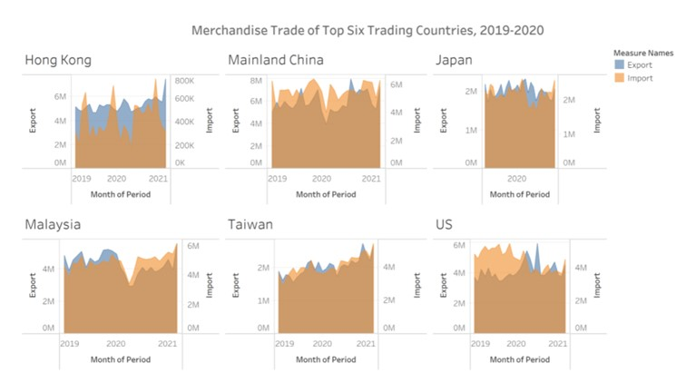

## 1.1 Clarity
**1.	Chart title is not precise**

The title and subtitle of the graph do not convey the intent of the graph well. In this case, the graph is demonstrating the changes in import and export volume 6 trading countries per month over two years. But the title does not mention that the graph is based on monthly data.

**2.	Axis standard not consistent**

In graph for **Hong Kong**, y-axis of the export is scaled with 'M', but the import is scaled with 'K'.
The x-axis for **Japan** only shows time data of 2020, but the other 5 countries are over 3-year period from 2019 to 2021.

**3. Quantitative scale of y-axis**

The measures on the y-axis of each country are not uniform. However, readers may directly compare the differences between countries based on the height of the points on the line. This can lead to inaccurate and misleading results. 

**4.	Axis title not properly labeled**

‘Month of Period’ is title of the x-axis, while the x-axis is shown in year period. This will make the readers very confused about what the horizontal axis represents.

**5.	Confused shaded color**

Line chart with color shading is used. But in this case, the color shading for the area is unnecessary. When the areas overlap, it is difficult for readers to distinguish two legends clearly.  In addition, there will be a third color in the part where import and export overlap, which will mislead readers so that people cannot easily tell which legend each color indicates.


## 1.2 Aesthetic
**1.**	Font size of subtitle for **‘Hong Kong’**, **‘Mainland China’** … should be smaller than the that of main title of ‘Merchandise Trade of Top Six Trading Countries’. Also, the subtitles of the six countries above the six charts are not in the middle of the graphic.  

**2.**	The use of color shading in the graphics is very unsuccessful. In fact, the shaded color here is not only unnecessary, but also increases the difficulty of reading for readers. The two colors also generate a third color when overlap, which makes the reading of the chart more inaccurate.

**3.**	Different colors are used to demonstrate import and export respectively. However, the shade color makes it even confused for readers to observe as there appear 3 different colors. 

**4.**	Legends in the very right-hand side lonely leave room under it.

**5.**	Tick marks on the x-axis are inconsistent. Values on y-axis have no scale, which might confuse readers regarding that the values are absolute values.


# 2.0 Alternative Design
The proposed design is inspired by Tamás Varga and is shown as follows.

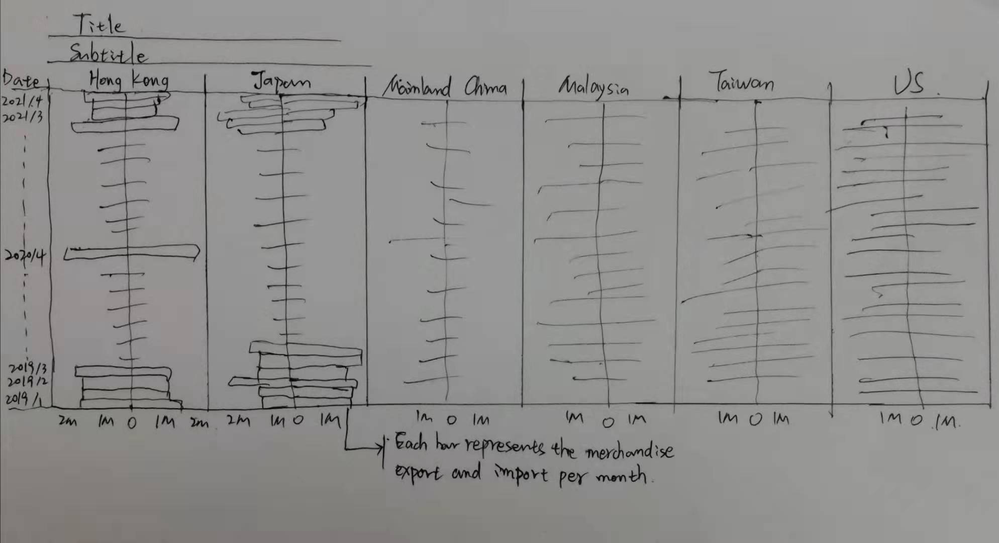{width=80%}


## 2.1 Advantages of proposed design
**1.** Title and subtitle explain key words that will be used in the graph. No additional transformation is done to the data, only using import, export, date, and country/region as the basis for the graph.

**2.** The merchandise trading situation of the six countries is displayed on one graph, which makes it possible to measure their merchandise trading volume on the same scale and enables readers to read and compare import and export results across different years and different countries more easily.

**3.** A Pyramid bar chart is used. On the one hand, it clearly shows the trend of changes in the import and export volume of each country over time in the vertical direction. On the other hand, it also enables readers to compare the differences in merchandise trade between different countries at the same time period horizontally.

**4.** Colors of black and red are used to differentiate export and import visually. 


# 3.0 Proposed Visualization
Please view the interactive visualization on Tableau Public [**here**](https://public.tableau.com/profile/xu.dan3204#!/).

# 4.0 Step-by-step Guide
**1.** Select used data

Select only the total merchandise imports and exports of the top 6 countries and paste into a new sheet using Microsoft Excel.


**2.** Reorganize the dataset

Put all six countries/regions under column D. **Trade** in column B is dummy variable with import and export. At the same time, the data of the **US** is multiplied by 100 and converted into ‘Thousand Dollars’, which is consistent with the data scale of other countries.

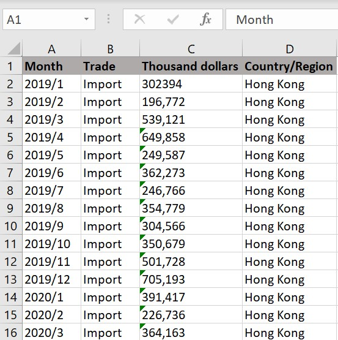{width=50%}

**3.** Import the data into Tableau

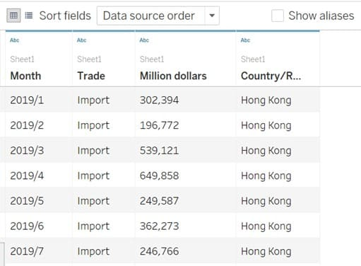{width=50%}

**4.** Rename headers

Rename ‘Thousand dollars’ to ‘Volume'.

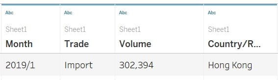{width=60%}

**5.** Change Data Type

Change the data type of ‘Volume’ from String to Number (whole).

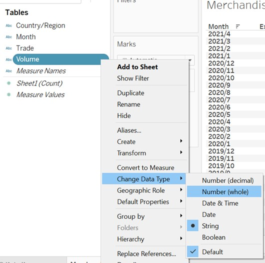{width=50%}

**6.** Drag **Month** to Rows and sort order to Descending. Then drag **Trade** to Columns.

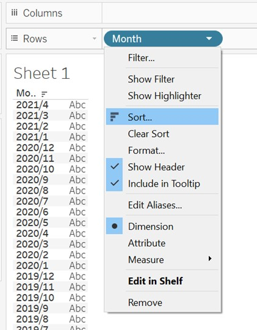{width=50%}
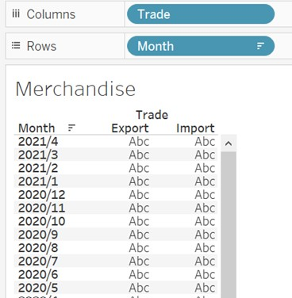{width=50%}

**7.** Drag **Volume** to Columns and change its Measure to Sum. 

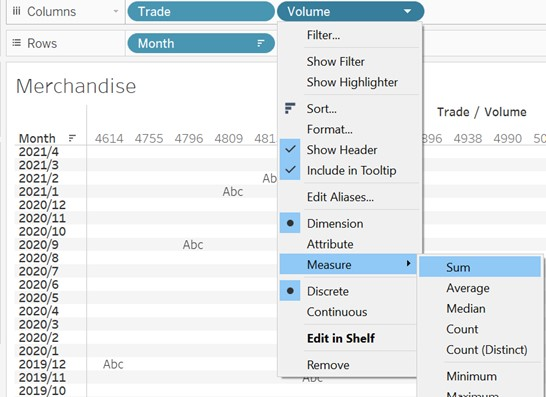{width=50%}

**8.** Add a calculated file for import and export respectively.

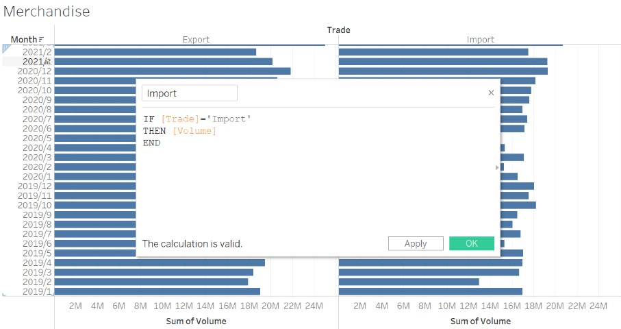{width=60%}
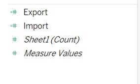{width=40%}

**9.** Remove **‘Trade’** and **‘Volume’** from Columns and drag **‘Import’** and **‘Export’** to Columns instead. 

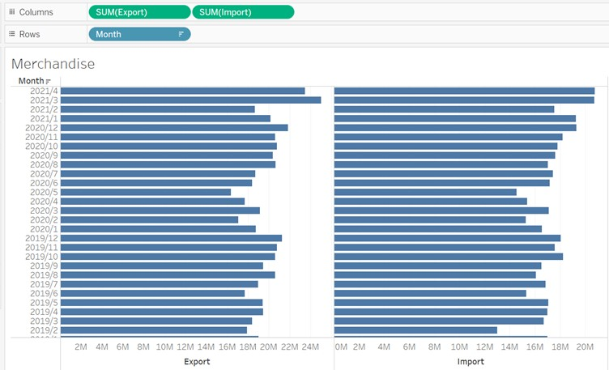{width=70%}

**10.** Edit Axis of **‘Export’** by Reversed.

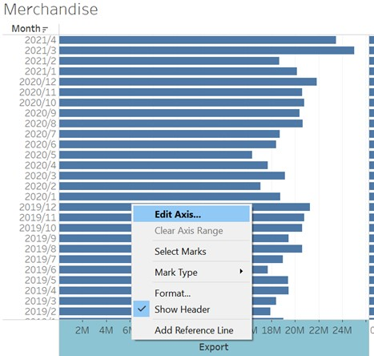{width=50%}

The chart then looks like below.

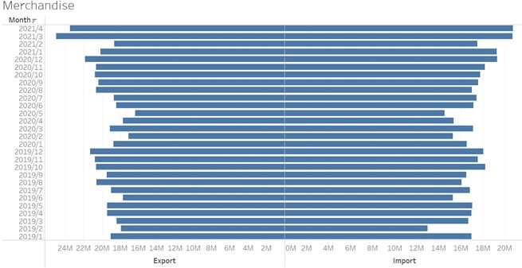{width=60%}

**11.** Change the **‘Export’** and **‘Import’** bars to black and red respectively to differentiate the trade type.

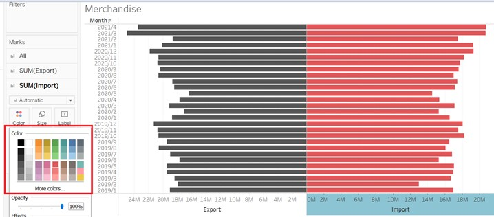{width=80%}

**12.** Add filter 

So far, the chart displays the total export and import of six countries monthly. We should add a filter for **‘Country/Region’** to observe the merchandise trade situation of each country. Select the desired Country/Region for observation. In this case, **Hong Kong** is chosen. Show the **‘Country/Region’** filter on the sidebar.

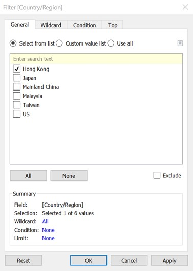{width=50%}

**13.** The graph should now look like this.

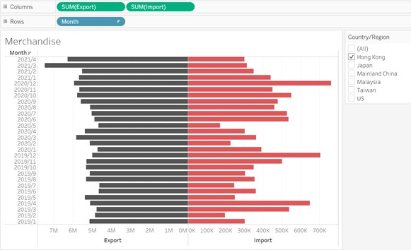{width=80%}

**14.** Select Single Value (list) under **‘Country/Region’** filter allows the chart to be displayed individually according to the country/region.

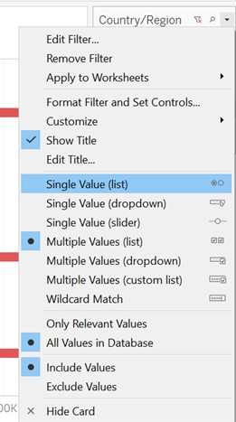{width=50%}

**15.** Edit Title

Double click the title pane and select **Country/Region** under Insert tab. This allows the chart name to be automatically displayed based on the **Country/Region**.

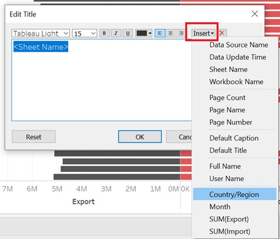{width=50%}

**16.** Right click on **(All)** and uncheck **Show “All” Value** under Customize. 

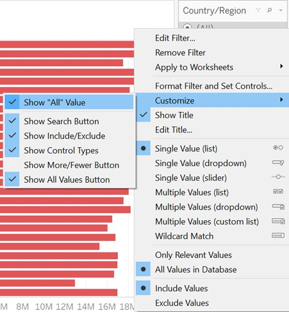{width=50%}

**17.** Drag **Import** and **Export** to **Tooltip** and then edit Tooltip to change **Import** to red and **Export** to dark. Also add $ and K symbols before and after <SUM(Import)> respectively.

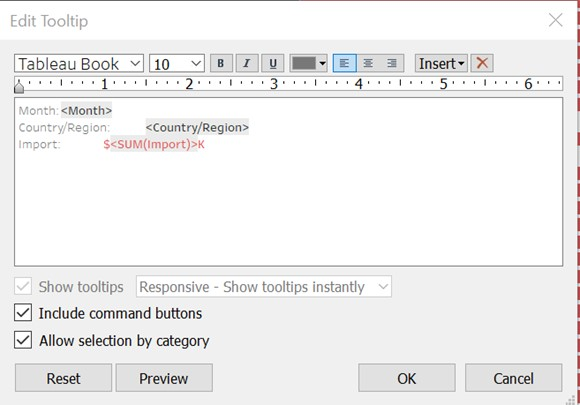{width=50%}

**18.** The base graph should look like this.

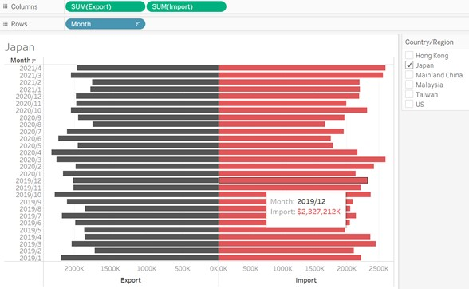{width=70%}

**19.** Remove **‘Country/Region’** from ‘Filters’ pane and drag it to Columns to display all six charts simultaneously. Also edit the main title for the visualization.

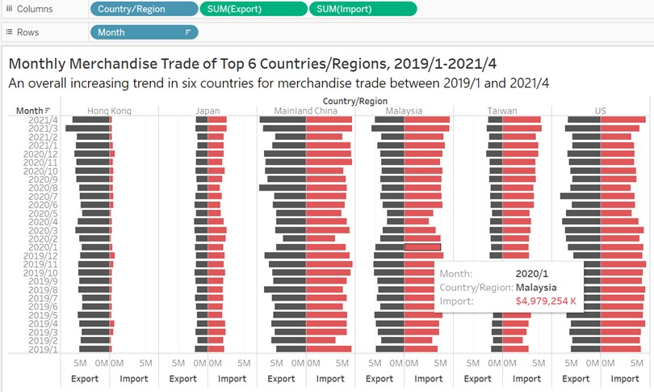{width=80%}

# 5.0 Derived insights

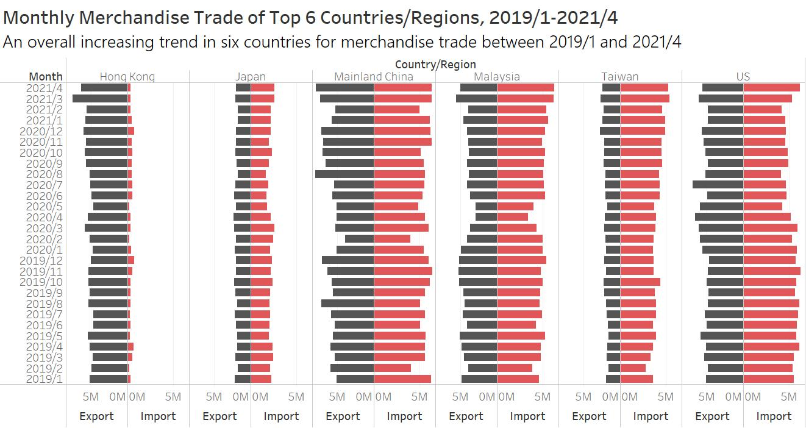{width=80%}

**1.** Overall, from January 2019 to April 2021, merchandise trade in the top 6 countries has shown an upward trend. From an individual point of view, the United States is the only one of the six countries where merchandise trade has a decreasing trend.

**2.** From the perspective of merchandise trade volume, Mainland China and the US are the two countries with the largest total transaction volume among the six countries, while Hong Kong and Japan are the two with the smallest total transaction volume. Roughly based on the area of the pyramid bar, the merchandise volume between China and the United States is more than twice that of Japan and Hong Kong.

**3.** From the comparison of imports and exports, we can intuitively find that Hong Kong is an obvious export-oriented region. Correspondingly, Taiwan is a relatively typical import-oriented country. Japan and the United States have relatively balanced imports and exports. The import trade between Malaysia and China is slightly larger than the export trade. This is because the two countries have sufficient product resources and labor, so there is more surplus for export.

**4.** From February to June 2020, these countries and regions have suddenly shortened bars, that is, merchandise trade has dropped significantly, which coincides with the time when COVID-19 broke out in these countries.


