```{r setup, include=FALSE}
knitr::opts_chunk$set(echo = FALSE)
```


# 1.0 Critique of Visualization
The original visualization can be seen below.

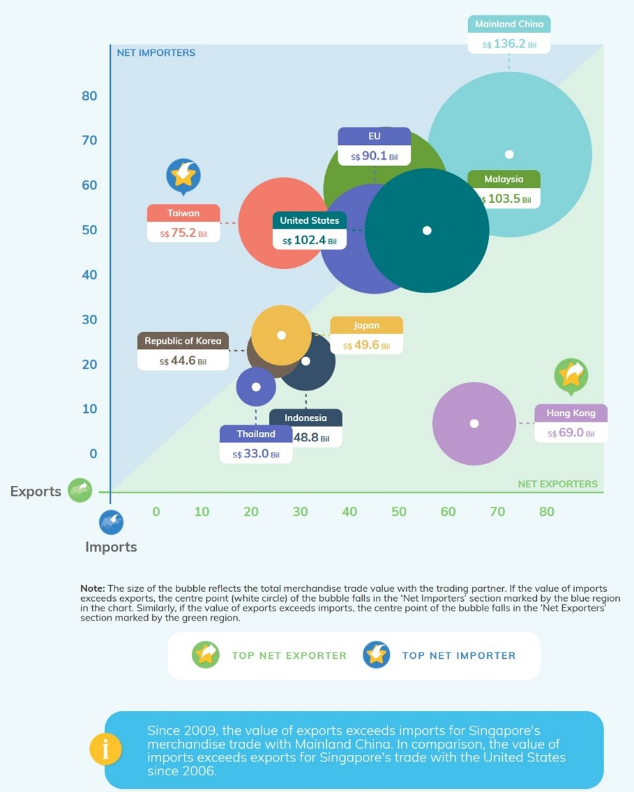

## 1.1 Clarity

1. The title and notes of the data visualization do not convey the information well. We cannot read why these countries/regions are displayed in this chart. 

2. The x-axis and y-axis label numbers without scale and units, which make it ambiguity as readers cannot recognize directly what the x and y axis indicate.

3. The plot did not indicate the information given by the blue box in the bottom. 

4. The places of the two bubbles are quite confused as the place of the central white point for each circle is not very easy to identify, especially for those countries who are on or near the diagonal line.

5. The position of ‘Exports’ and ‘Imports’ for x-axis and y-axis are quite confused. It will be much clearer to place them below or in the left of the axis center. 

## 1.2 Aesthetics

1. The bubbles overlap each other, make it hard to see the exact area it located to tell the ‘net importer’ of ‘net exporter’

2. The size of these bubbles is relatively too large. When several bubbles overlap each other, the importance of the data is occupied.

3. The colors and shadings are beautiful and attractive, but, as mentioned above, the focus is the data, so the guest has been declared the master.


# 2.0  Proposed Design
The initial sketch of proposed design is as following:


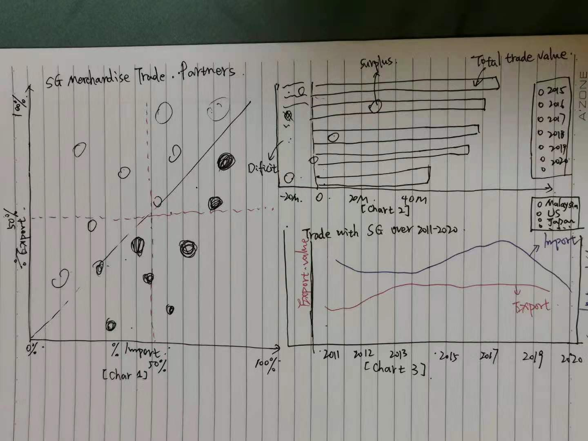{width=80%}

## 2.1 Clarity

1. X-axis and y-axis: chart 1 keep to the primary axis just change to percentile. So, there is no need to care about the units.

2. Chart type: The three graphs describe Singapore's trading partners from the macro perspective to the micro perspective. As for the bar chart, the trade deficit or trade surplus is also shown based on the zero-value reference line. 

3. Titles: Chart title for each chart is corresponding to the chart.

4. Animation is used to show the volume change and trend. 


## 2.2 Aesthetics

1. Legend: The legend is placed on the right side of the chart. Readers ca 

2. Title for each chart aligns to the top; choose distinctive font sizes for main visual title and chart title.

3. Chart order and sizing: The largest graph shows the overview of transaction distribution among the overall trading partners. The two small charts on the right are relatively detailed.

4. Size: Use appropriate size of the circles to display the relative position of those countries/regions.

5. Colors and shading: Remove the overlap between those bubbles. Overlay the area charts with line charts to allow readers to identify the trend easier.


# 3.0 Proposed Visualization
Please view the interactive visualization on Tableau Public [**here**](https://public.tableau.com/app/profile/xu.dan3204/viz/MonthlySingaporeMerchandiseTrade/Dashboard1).


# 4.0 Step-by-step Guide

1. Unzip the output folder downloaded from the xxx website. Load the outputFile excel into Tableau Prep Builder. Drag the ‘T1’ and ‘T2’ worksheet into the data connection pain.

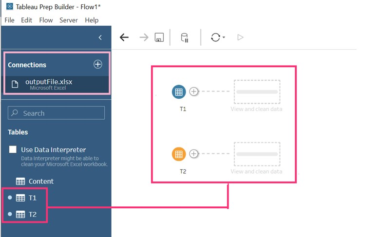{width=80%}

2	Select the Data Interpreter and rename ‘T1’ and ‘T2’ to ‘Import’ and ‘Export’, respectively. Then initiate Clean node for each data node.

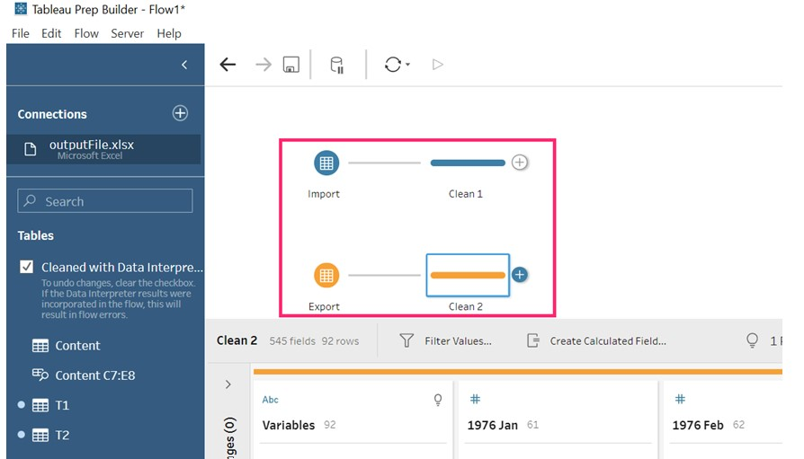{width=80%}

3	Under ‘Clean 1’, clean ‘Variables’ using ‘Split Values’ with ‘(’ as the separator. Rename column as ‘Country/Region’. Repeat for ‘Clean 2’. 

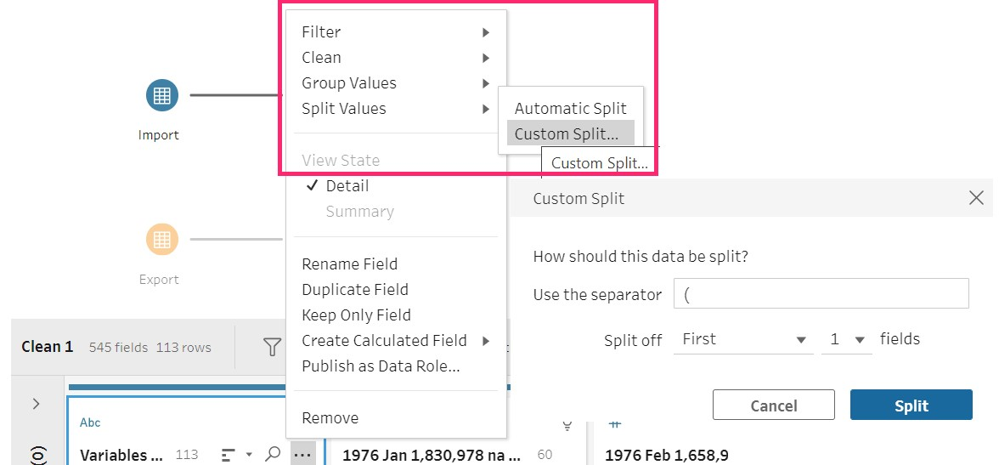{width=80%}

4	Add Pivot nodes after ‘Clean 1’ and ‘Clean 2’. Under each pivot, select all months under ‘Fields’ and drag to ‘Pivoted Fields’.


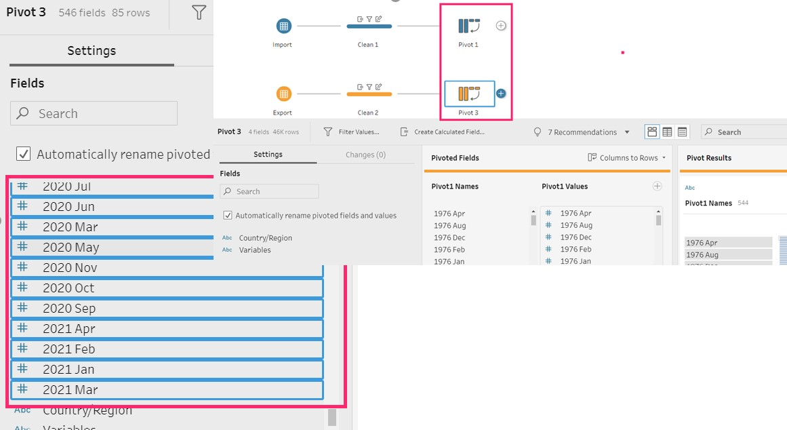{width=80%}

5. Rename ‘Pivot 1 Names’ to ‘Month’ and change data type to ‘Date’. Rename ‘Pivot 1 Values’ to ‘Import ($1000)’. Repeat for ‘Pivot 2’ but rename as ‘Export ($1000)’.


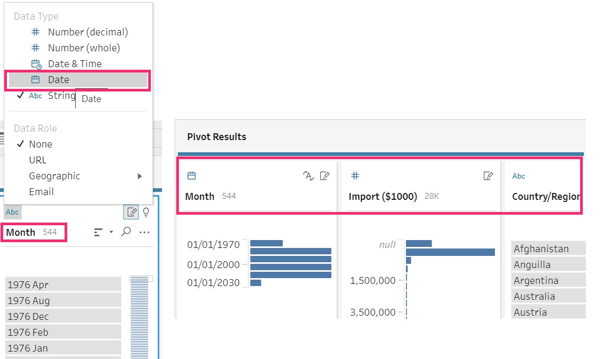{width=80%}


6. Do full join between ‘Pivot 1’ and ‘Pivot 2’ applying ‘Country/Region’ and ‘Month’ clauses.


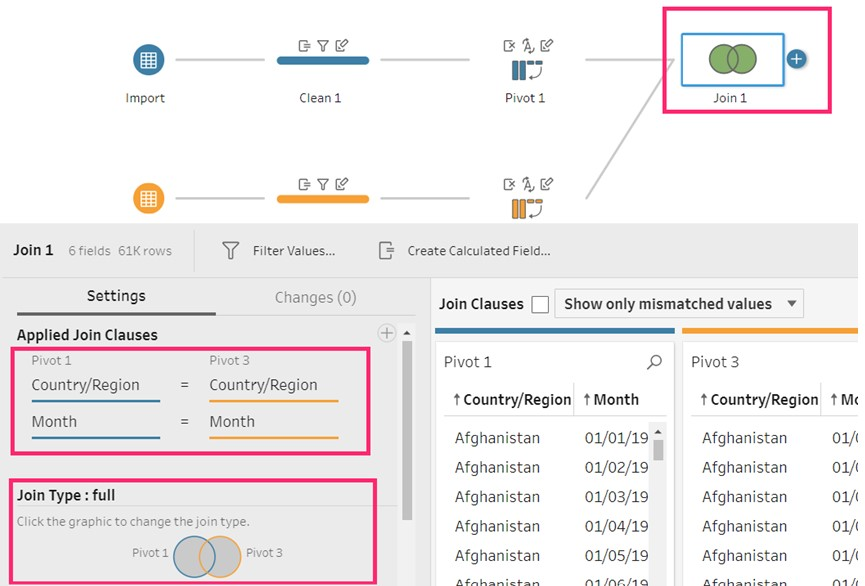{width=80%}


7. Drag and drop one field onto another to merge fields of country/region and month variables.


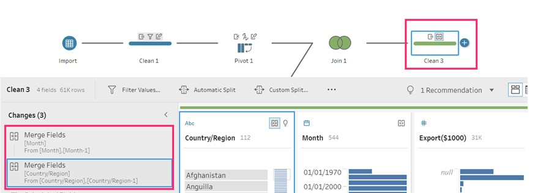{width=80%}

8. Create ‘Pivot’ node after ‘Clean 3’. Pivot columns to rows for ‘Import ($1000)’ and ‘Export ($1000)’ variables.

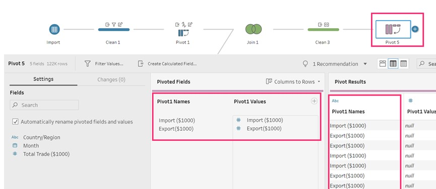{width=80%}

9.	Split ‘Pivot1 Names’ and rename ‘Pivot1 Names-Split 1’ to ‘Trade Type’. Rename ‘Pivot1 Values’ as ‘Trade Value’. Remove unnecessary fields.
 

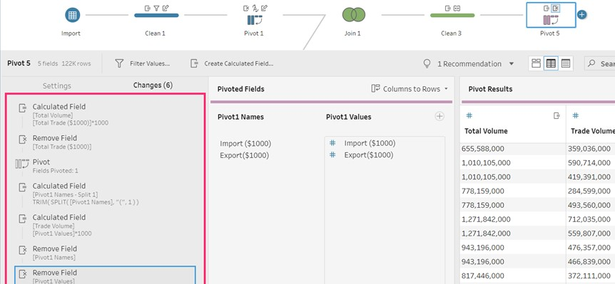{width=80%}

10.	Create a ‘Output’ node after ‘Pivot 3’ node and save as ‘Monthly Singapore Merchandise Trade’.


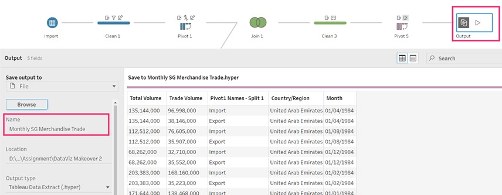{width=80%}


11.	Set up a connection on Tableau Desktop to the ‘Monthly Singapore Merchandise Trade’ hyper’s extract.


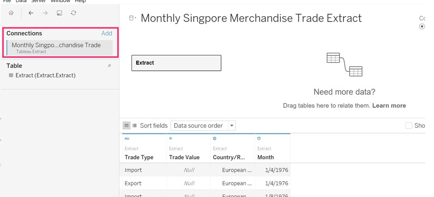{width=80%}


12	Synchronize Axis and fix both import and export data range fixed from 0 to 80,000,000.	 

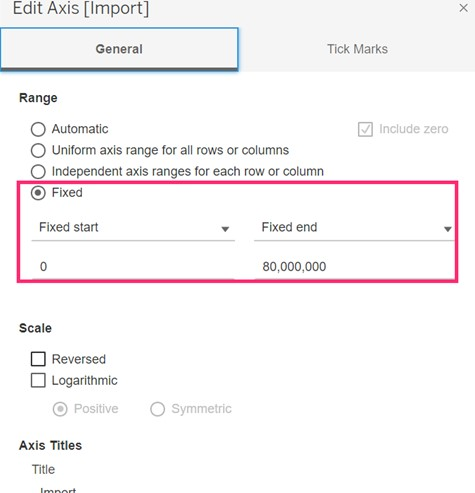{width=80%}


13.	In sheet 1, name it ‘Top 10 partners’ and create calculated fields ‘Export+Import’, ‘Export-Import’, ‘Surplus’, and ‘Deficit’.


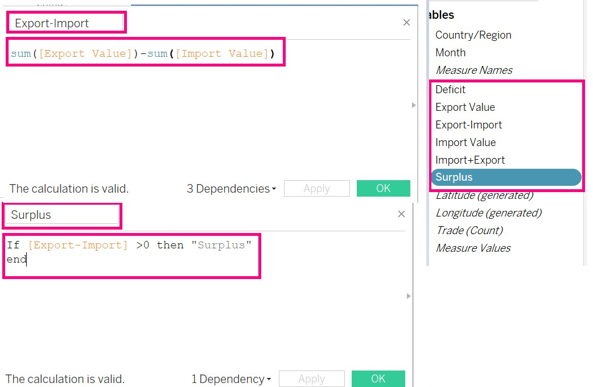{width=80%}

14.	Drag ‘Import+Export’ and ‘Import-Export’ to ‘Columns’ and ‘Country/Region’ to ‘Rows’.


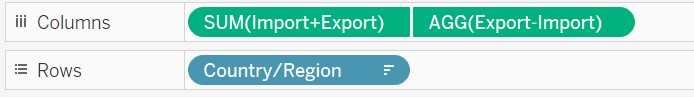{width=80%}

15. Drag ‘Month’ to ‘Filter Field’ section. Select ‘Range of Dates’ and indicate ‘1/1/2011’ as the start and ‘1/12/2020’ as the end date.


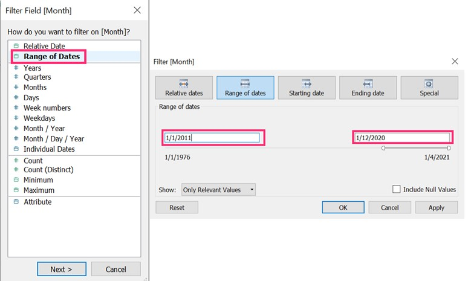{width=80%}


16	Drag ‘Country/Region’ to the ‘Filter Field’ section. Select the ‘Top’ tab and choose the top 10 by sum of ‘Import+Export’. 


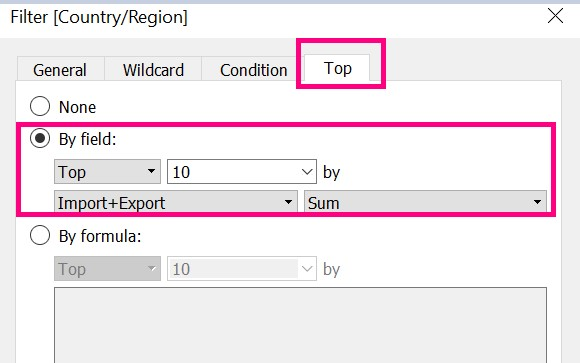{width=80%}

17	Under Marks, select ‘Bar’ under dropdown and drag ‘Surplus’ to ‘Color’. Drag ‘Deficit’ to ‘Tooltip’ and edit color for Surplus and Deficit.


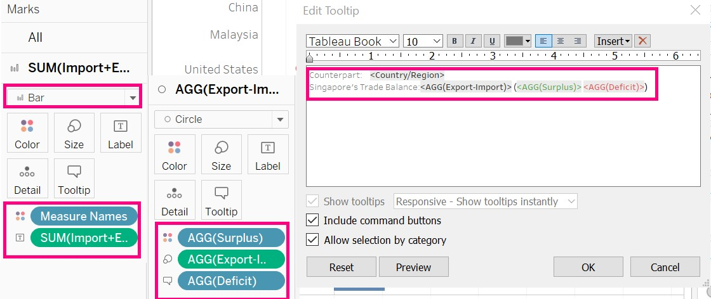{width=80%}

18	Choose ‘Dual Axis’ under ‘Export-Import’ dropdown list.  Click on the X-axis of ‘Export-Import’ and select ‘Synchronize Axis’.


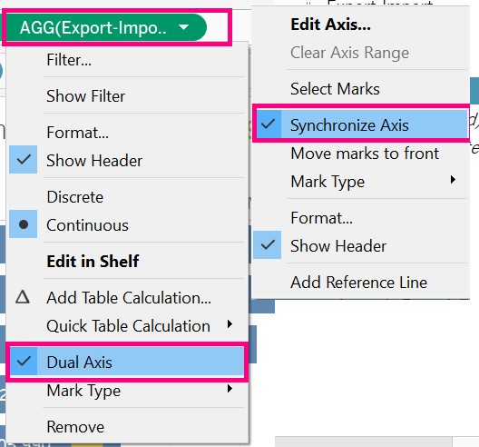{width=80%}

19	Bold the country values, year, X-axis and Y-axis values. Also set different colors to clarify.


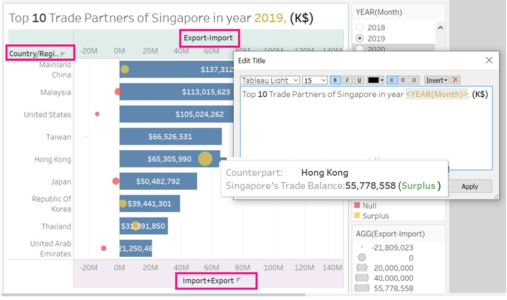{width=80%}


20	For Chart 2, create a new worksheet and name it as ‘Top n partners’. Drag ‘Import Value’ to Columns and ‘Export Value’ to Rows. Create a parameter called ‘Top n’ and set range of values.  


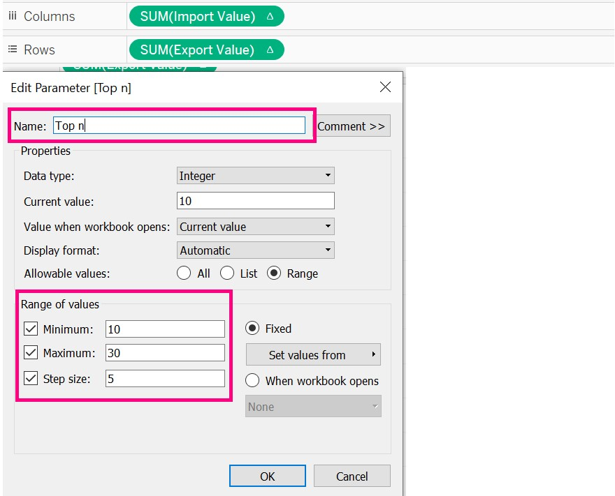{width=80%}

21	Select Percentile for both ‘Import Value’ and ‘Export Value’ and ‘Compute Using’ as ‘Country/Region’. Drag ‘Export-Import’ to Color and ‘Country/Region’ to Detail. 


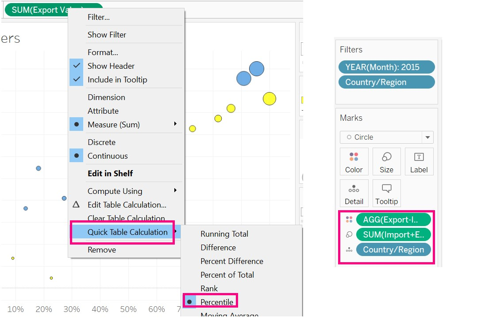{width=80%}


22	Edit colors stepped 2 steps. 

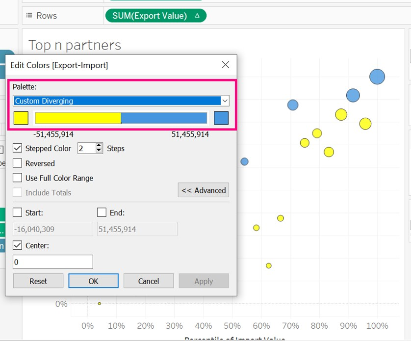{width=80%}

23	For Chart 3, create calculated fields of ‘Dif value’, ‘Net Import’ and ‘Net Export’.

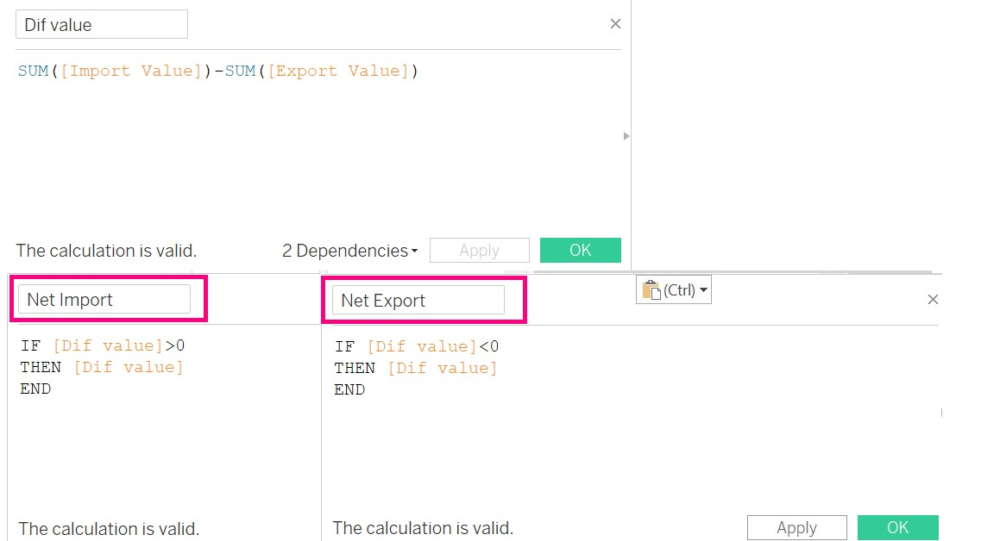{width=80%}


24	Drag ‘Net Import’ and ‘Net Export’ to Rows and drag ‘Month’ to Columns. Repeat previous steps for filtering year range. And then edit title.


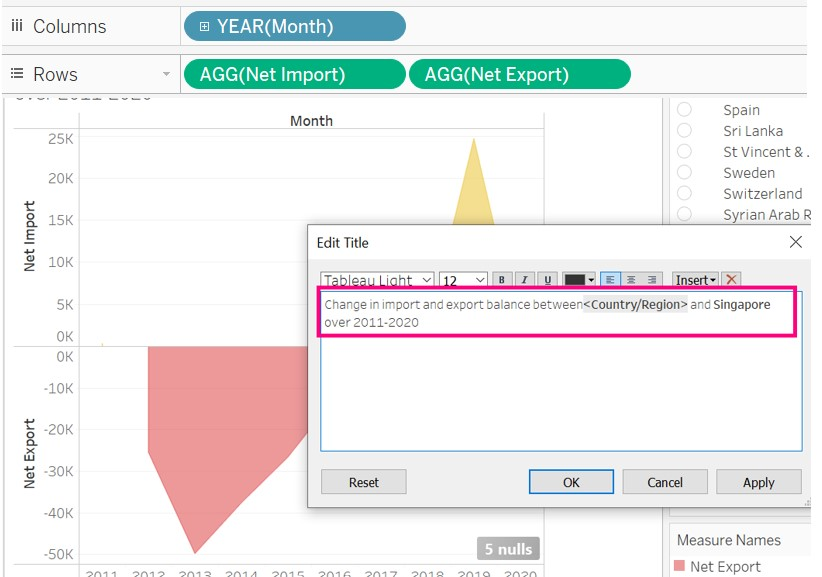{width=80%}


25	Create a ‘Dashboard’. Drag sheets ‘Top n partners’, ‘Trade with Singapore over 2011-2020’, and ‘Top 10 partners’ to the right-hand dashboard. Add a dashboard title as 'Singapore Merchandise Trade Partners'. 


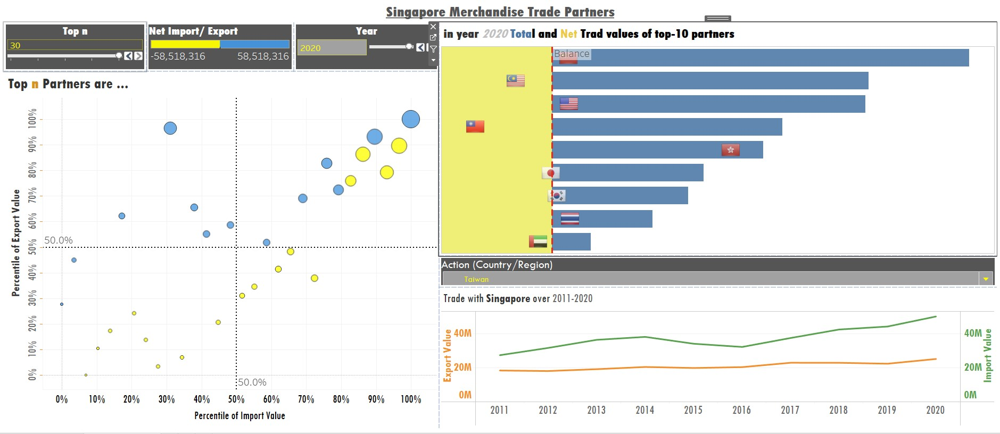{width=80%}

26	Finally, hide the worksheets and publish the dashboard to Tableau Public.

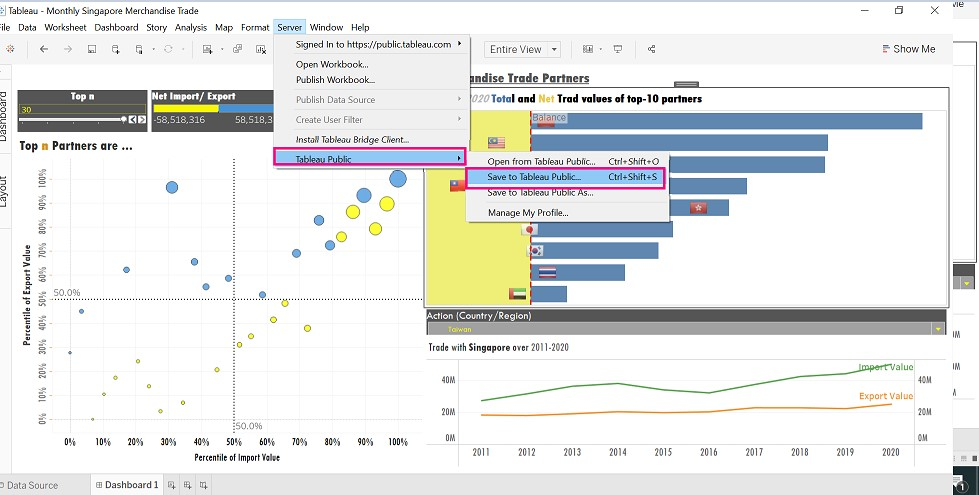{width=80%}

# 5. Major observations

1.	Top n partners: By observing the merchandise transactions of Singapore's top 10 to top 30 trading partners, we can see that Singapore is a country with a trade deficit, because Singapore has more countries that import goods than countries that export goods.

2.	Top 10 trade partners: over the 10-year period, Malaysia was the most important merchandise trade partner for Singapore in 2011 and 2012 based on its number 1 position of total trade volume. Since 2013, Mainland China began to surpass Malaysia and became the largest partner for Singapore.  In year 2020, in terms of total import and export volume, Mainland China is Singapore’s largest trading partner of 136.2 billion dollars. Following by Malaysia of about 100 billion dollars. It is worth noted that Japan and Republic of Korea are on the reference line, their imports and exports with Singapore basically maintained a balance.

3.	Trade balance change:  the United States was a net importer for Singapore between 2011 and 2019, while the US suddenly imported $5 billion more than exported from Singapore in 2020.  For example, obviously, Uruguay has become a net importer for Singapore since 2017. Net imports increased sharply from 676 thousand U.S. dollars in 2017 to 24658 thousand U.S. dollars in 2019. However, by 2020, this difference has dropped to below 1,000 thousand U.S. dollars. 


